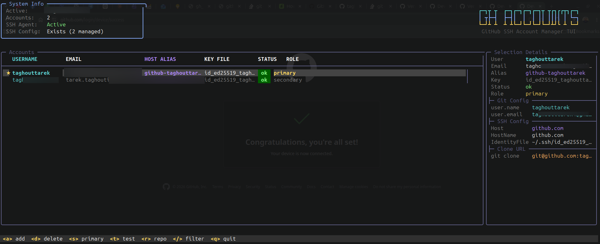

# gh-accounts

> GitHub multi-account SSH manager (TUI)

## Overview

`gh-accounts` is a small terminal UI (TUI) script that helps you manage multiple GitHub SSH identities and the related `~/.ssh/config` entries. It stores accounts in `~/.ssh/.gh_accounts`, can generate keys, add them to `ssh-agent`, and update Git global config for the selected primary account.



## Requirements

- **Bash** (POSIX + some bashisms)
- **ssh-agent** / **ssh-add**
- **ssh-keygen** (for generating keys)
- **git** (for updating global config)
- **python3** (used for config editing)
- Terminal with `tput` support (most terminals)

## Installation

Quick install using the provided installer (recommended):

```bash
bash install.sh            # creates ./bin/gh-accounts symlink to gh-accounts.sh
# or install to a custom location, e.g. ~/.local/bin
bash install.sh --dest ~/.local/bin
```

Make sure the destination directory is in your `PATH`, for example add to your shell profile:

```bash
export PATH="$HOME/.local/bin:$PATH"
```

Manual install:

1. Make the script executable:

```bash
chmod +x gh-accounts.sh
```

2. Move it somewhere on your PATH (optional):

```bash
mv gh-accounts.sh /usr/local/bin/gh-accounts
```

## Usage

Run the script from a terminal:

```bash
./gh-accounts.sh
```

The script requires an interactive terminal. If you see "error: gh-accounts requires an interactive terminal.", run it from a tty.

Keybindings inside the TUI:

- **a**: Add account (username, email, host alias, key file)
- **d**: Delete account
- **s**: Set selected account as primary (updates global git config)
- **t**: Test SSH authentication for selected account
- **r**: Show repo config helper for selected account
- **/**: Filter accounts
- **q**: Quit

Signal handling

- Pressing Ctrl-C (SIGINT) will now run the cleanup routine and exit the script, restoring the terminal to its previous state. The script traps SIGINT/SIGTERM and calls cleanup, so the terminal should not remain attached after Ctrl-C.

## Files and storage

- Accounts are stored in `~/.ssh/.gh_accounts` (one entry per line, pipe-separated).
- The script manages `~/.ssh/config` by adding/removing blocks marked with `# gh-accounts:` comments. It rewrites managed blocks when the primary account changes.

## Examples

- Add an account via the TUI: press `a`, enter `username`, `email`, `host alias` (e.g. `github-username`), and `key file` name (e.g. `id_ed25519_username`). The key will be generated with `ssh-keygen` if it doesn't exist.
- To ensure your keys are available to the agent before running the TUI:

```bash
eval "$(ssh-agent -s)"
ssh-add ~/.ssh/id_ed25519_you
```

## Troubleshooting

- Terminal remains in alternate screen or cursor hidden after exit: Ensure the script ran its `cleanup()` (it traps EXIT, INT, TERM). If the terminal is still in an odd state, run:

```bash
tput rmcup || true
tput cnorm || true
reset
```

- The script says it needs an interactive terminal: run it in a normal terminal (not from a backgrounded job or non-interactive environment).

- SSH authentication failures: verify your key files, ensure `ssh-agent` is running and that the key is added with `ssh-add`.

## Contributing

Patches, bug reports and improvements are welcome. Please open an issue or submit a pull request.

When editing `gh-accounts.sh`, keep terminal state handling intact: `alt_screen_on`, `alt_screen_off`, cursor hiding/showing, and the `cleanup()` trap are important to avoid leaving the terminal in an unusable state.

## License

MIT
